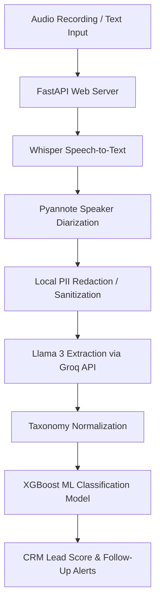

# Nexus AI | Enterprise Audio Intelligence System Guide

Welcome to the **Nexus AI** system. This system acts as a conversational CRM intelligence engine that extracts structured insights from sales recordings or typed texts and scores leads for conversion probability.

---

## 1. System Architecture & Flow

The application processes text inputs or audio recordings through a multi-stage pipeline:



1. **Transcription & Diarization**: Audio files are transcribed using OpenAI Whisper. Speaker turn durations and customer/agent separations are calculated using Pyannote.audio.
2. **Local PII Redaction**: Sensitive Customer PII (Names, Phone Numbers, Emails) is detected and redacted locally before calling LLMs to maintain privacy constraints.
3. **Llama 3 Information Extraction**: Using Groq's high-speed API, Llama-3-70B extracts mentions of product features, brands, budget details, customer objections, and intent levels.
4. **XGBoost Lead Scoring**: Extracted signals are aligned into tabular features and fed into an XGBoost classifier which predicts whether the lead is `hot` (prob >= 0.7), `warm` (prob >= 0.4), or `cold` (prob < 0.4).
5. **Follow-Up Engine**: Actionable reminders and priority tasks are generated automatically from conversations and logged in a SQLite3 store.

---

## 2. Directory Structure

- `src/` - Python core application codebase.
  - `src/api/server.py` - FastAPI entrypoint containing HTTP and WebSocket routes.
  - `src/api/worker.py` - Task worker handling background queue for audio files.
  - `src/aspect_sentiment/` - Signal detection, NLP scoring rules, VADER sentiment, PII privacy filters, and model fusion.
- `frontend/` - Next.js React Dashboard styled with Tailwind CSS and Framer Motion.
- `data/` - Dataset processing directories. Contains raw transcript inputs, SQL databases, and SQLite metrics.
- `models/` - Pickled artifacts of the trained XGBoost model (`sales_conversion_model.pkl`) and tabular schemas.
- `audio/` - Sample WAV files.
- `scripts/` - Shell/Batch files to easily start backend and frontend services.

---

## 3. Configuration & Startup

Ensure you copy `.env.example` to `.env` and `.env.local` inside the root directory and update them with your Groq and Hugging Face tokens:

```ini
LLAMA_API_KEY=your_groq_api_key
HUGGINGFACE_TOKEN=your_huggingface_token_if_using_pyannote
```

### Starting the System

To start the servers:
1. **Automated Startup (Windows)**:
   Double-click the [START.bat](file:///d:/Project%20-AI%20audio/scripts/START.bat) script to run checks and launch backend & frontend servers automatically.
2. **Manual Startup**:
   - **Backend**:
     ```bash
     .venv\Scripts\python.exe -m uvicorn src.api.server:app --reload --port 8000
     ```
   - **Frontend**:
     ```bash
     cd frontend
     npm run dev
     ```

---

## 4. Diagnostics & Testing

We provide three layers of test verification to ensure everything runs perfectly:

1. **System Sanity Check (`test_system.py`)**:
   Checks that the virtual environment imports all packages correctly, the spaCy NLP engine compiles, and pre-trained XGBoost pickle models are loaded.
   ```bash
   .venv\Scripts\python.exe test_system.py
   ```
2. **API Endpoint Integration Test (`test_audio_upload.py`)**:
   Fires live API requests to `/api/health`, runs text processing, uploads a local test WAV file, and polls the job worker.
   ```bash
   .venv\Scripts\python.exe test_audio_upload.py
   ```
3. **Browser Diagnostic Dashboard (`audio-upload-debug.html`)**:
   Open `http://localhost:5173/audio-upload-debug.html` in your browser once the frontend is running to trace status logs and debug connection failures.
