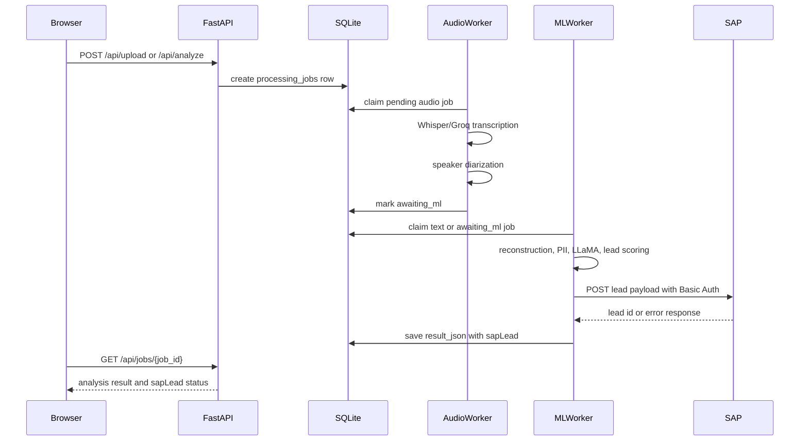

# SAP C4C Lead Creation Integration

## Architecture

SAP C4C lead creation runs after Nexus AI finishes its normal analysis pipeline. API routes remain thin, AI processing remains unchanged, and SAP failures are captured in the result without failing the AI job.



## Updated Folder Structure

```text
src/
  integrations/
    sap_c4c/
      __init__.py
      client.py
      config.py
      mapper.py
  services/
    sap_lead_service.py
  workers/
    run_worker.py
frontend/
  scripts/
    serve-static.mjs
  src/components/sections/ExtractionSection.tsx
  src/services/api.ts
  src/store/useAppStore.ts
tests/
  test_sap_integration.py
```

## Changed Files

- `src/integrations/sap_c4c/config.py`: loads SAP environment variables, timeout, retries, and validates required Basic Auth settings.
- `src/integrations/sap_c4c/client.py`: reusable async SAP client with Basic Auth, JSON headers, timeout handling, retries, structured logging, and typed exceptions.
- `src/integrations/sap_c4c/mapper.py`: maps Nexus AI output to the SAP payload fields.
- `src/services/sap_lead_service.py`: service layer that calls SAP and returns a non-fatal `sapLead` status object.
- `src/workers/run_worker.py`: production ML worker attaches `sapLead` after AI analysis.
- `src/api/worker.py`: legacy in-memory worker attaches `sapLead` for compatibility.
- `frontend/src/services/api.ts`: includes `sapLead` in typed backend analysis and mapped UI features.
- `frontend/src/store/useAppStore.ts`: stores SAP lead status with feature results.
- `frontend/src/components/sections/ExtractionSection.tsx`: displays lead created, lead number, creation status, and errors.
- `frontend/package.json` and `frontend/scripts/serve-static.mjs`: fixes static-export frontend startup.
- `.env.example` and `requirements/api.txt`: documents SAP env vars and ensures `httpx` is available.
- `src/core/logging.py`: includes SAP status fields in JSON logs.
- `src/ml/__init__.py`: fixes a pre-existing indentation import error.

## Environment Variables

```env
SAP_C4C_ENABLED=false
SAP_C4C_ENDPOINT=https://my1000596.de1.test.crm.cloud.sap/sap/c4c/api/v1/lead-service/leads
SAP_C4C_USERNAME=
SAP_C4C_PASSWORD=
SAP_C4C_TIMEOUT_SEC=10.0
SAP_C4C_LEAD_SOURCE=Z3
SAP_C4C_MARKET_SEGMENT=001
```

`SAP_C4C_ENABLED=false` returns `sapLead.sapStatus=disabled` and never calls SAP. When enabled, endpoint, username, and password are required.

## SAP Payload Mapping

| SAP field | Nexus AI source | Fallback |
| --- | --- | --- |
| `name` | customer name | `Lead Prospect - Prospect Lead` |
| `source` | `SAP_C4C_LEAD_SOURCE` | `Z3` |
| `account.formattedName` | `privacy.grouped.customer_name` | `Prospect Lead` |
| `account.firstLineName` | `privacy.grouped.customer_name` | `Prospect Lead` |
| `account.address.region` | SAP-required empty object | `{}` |
| `account.address.email` | `privacy.grouped.email` | empty string |
| `account.address.mobileFormattedNumber` | `privacy.grouped.customer_number` or `phone` | empty string |
| `primaryContact.isPrimary` | fixed SAP primary contact marker | `true` |
| `primaryContact.givenName` | first token from customer name | `Prospect` |
| `primaryContact.familyName` | remaining customer name | `Lead` |
| `notes[0].content` | summary, product interest, intent, lead score, sentiment | default analysis note |
| `extensions.Z_K_MarketSegment` | `SAP_C4C_MARKET_SEGMENT` | `001` |

## API Result Shape

Completed jobs include:

```json
{
  "sapLead": {
    "leadCreated": true,
    "leadId": "165",
    "objectId": "510e08a1-81af-11f1-923b-d37dc5bdb092",
    "sapStatus": "success",
    "httpStatus": 201,
    "error": null
  }
}
```

Failures are non-fatal:

```json
{
  "sapLead": {
    "leadCreated": false,
    "leadId": null,
    "objectId": null,
    "sapStatus": "failed",
    "httpStatus": 500,
    "error": "SAP C4C returned HTTP 500"
  }
}
```

## Testing Guide

Run backend tests:

```powershell
python -m unittest discover tests
```

Run focused SAP tests:

```powershell
python -m unittest tests.test_sap_integration
```

Run frontend build/type validation:

```powershell
cd frontend
npm run build
```

## Deployment Guide

No database migration is required because SAP status is stored inside existing `processing_jobs.result_json`.

Production dependencies already include `httpx`; `requirements/api.txt` now includes it too. Docker does not need structural changes because it serves the exported frontend through FastAPI and starts both workers through `scripts/start.py`.

SAP lead creation is a non-idempotent POST. The client intentionally performs one POST attempt per completed analysis and does not automatically retry after timeout, network failure, or 5xx response. This avoids duplicate lead creation when SAP creates the lead but the response is lost.

Set SAP variables in Railway, Hugging Face Spaces, Docker, or local `.env`. Restart the API and ML worker after changing SAP credentials.

## Troubleshooting

- `sapStatus=disabled`: set `SAP_C4C_ENABLED=true`.
- Missing credential error: set endpoint, username, and password.
- `httpStatus=401`: check SAP Basic Auth username/password and account permissions.
- `httpStatus=400`: inspect the `payload` returned under `sapLead` in backend results and confirm SAP field requirements.
- `httpStatus=500` or network errors: the ML job still completes; check `logs/nexus_ai.log` for `sap_status`, `sap_http_status`, and retry attempts.
- Frontend start error with `next start`: use `npm run build` then `npm run start`; the project is a static export.
